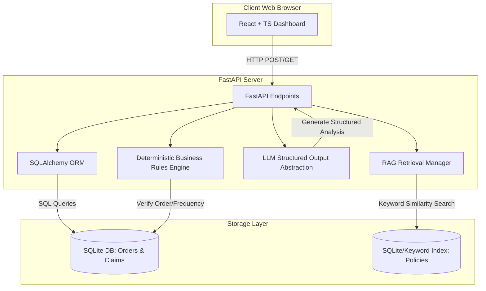

# System Architecture & Pipelines

This document contains Mermaid visual flowcharts representing the system architecture, AI analysis pipeline, and CI/CD processes for the **AI Retail Return Investigator**.

---

## 1. System Architecture

Shows the layout of the frontend browser interface, the FastAPI backend layer, the deterministic business rules processor, the RAG index, and database storage.

---

## 2. AI Analysis Pipeline

Depicts the step-by-step workflow a return request undergoes to reach a final validated decision:

```mermaid
flowchart TD
    A[Customer Submission] --> B[Request Validation]
    B --> C[Info Extraction & Order Matching]
    C --> D[RAG Policy Document Retrieval]
    D --> E[Deterministic Risk Evaluation]
    E --> F[LLM Decision Generation]
    F --> G[Decision Validation & Override Check]
    G --> H[SQL Database Persistence]
    H --> I[Return Explainable API Response]
    
    style G fill:#1e1b4b,stroke:#6366f1,stroke-width:2px
```

---

## 3. CI/CD Pipeline

Outlines the pipeline for testing, packaging, and deploying updates to the application:

```mermaid
flowchart LR
    subgraph CI [Continuous Integration]
        Lint[Lint & Format] --> Test[Python Unit Tests]
        Test --> Build[Build Frontend Bundle]
    end

    subgraph CD [Continuous Deployment]
        Build --> Pack[Package Docker Image]
        Pack --> Deploy[Deploy to Staging/Production]
    end
    
    style CI fill:#0f172a,stroke:#334155
    style CD fill:#0b0f19,stroke:#1e1b4b
```

